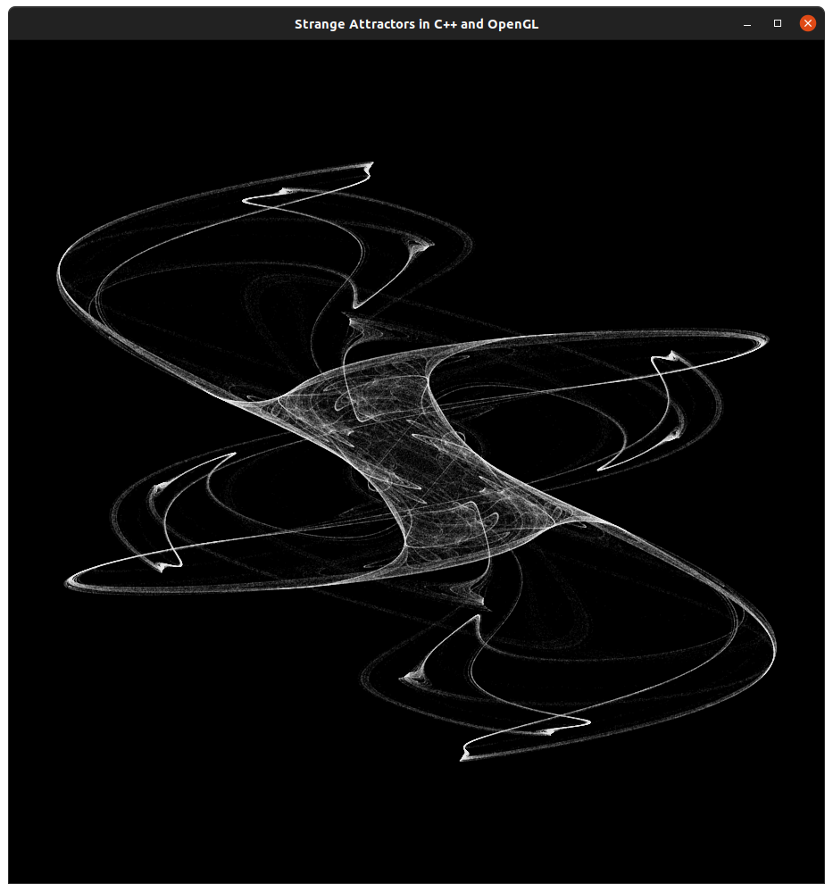

# Strange Attractor (OpenGL, GLUT)

# Requirements (Ubuntu)
> apt install freeglut3-dev cmake build-essential

# Ideas
- change the colors
- change the attractor’s coefficients (you may want to choose them randomly to start, although there are
- some additional calculations you can do to make an educated guess at parameters that create interesting images)
- make some changes to the strange attractor equations (substitute some known equations or make your own)
- modify the code to generate 3d strange attractors
- modify the code to make it interactive or animated
- who says the coefficients have to stay the same for a million iterations? try randomizing or interpolating them.
